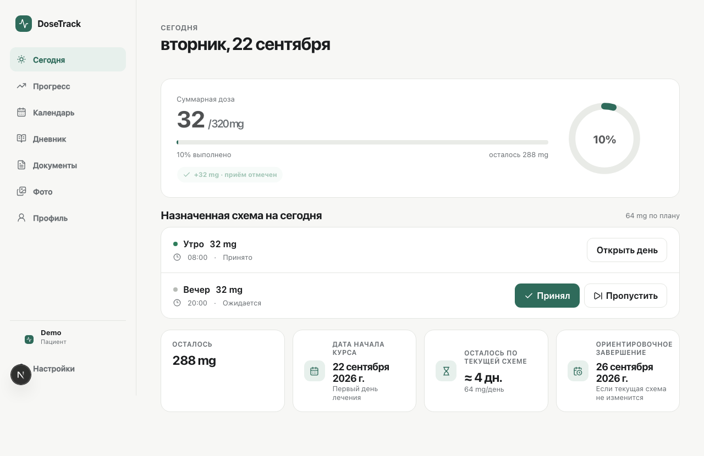
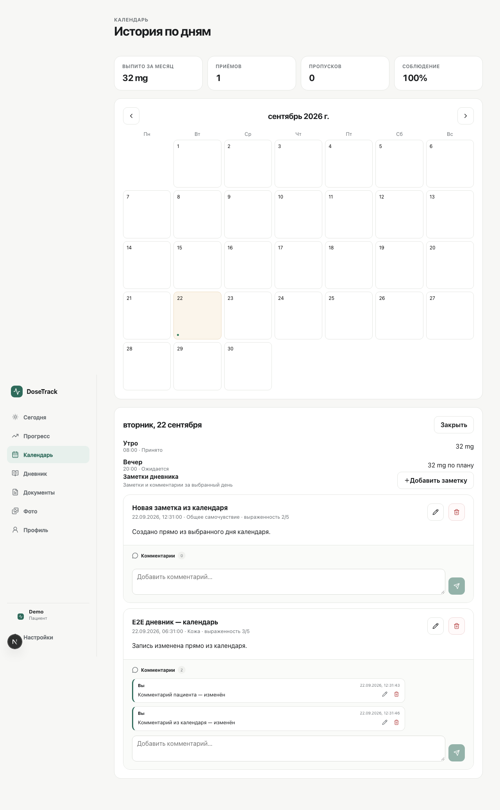
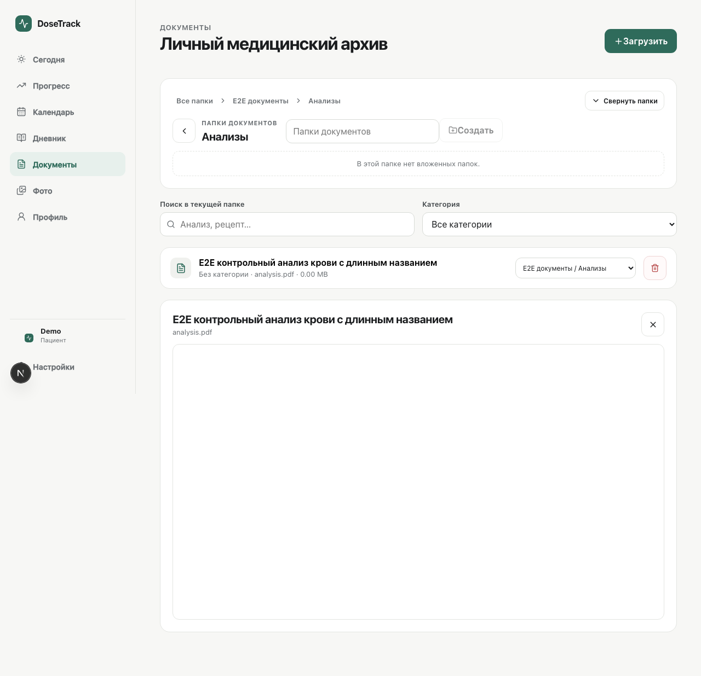
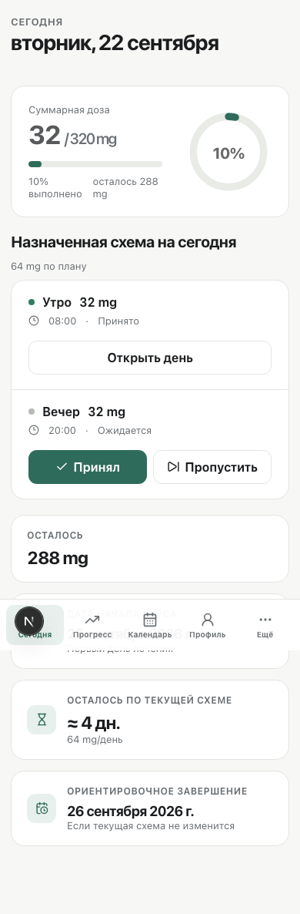

# DoseTrack

  <b>Личный full-stack сервис для контроля курса лечения</b> 
  Приёмы по расписанию · прогресс курса · календарь · дневник · документы · фото · доступ врача

  
  
  
  
  
  

## О проекте

DoseTrack я сделал как личный учебный full-stack проект, чтобы не держать курс лечения в заметках, таблицах и напоминаниях отдельно.

В одном месте можно сохранить назначенную схему, отмечать приёмы, смотреть накопленную дозу и историю по дням, вести дневник самочувствия, хранить документы и фотографии прогресса. При необходимости врачу можно дать отдельный доступ на просмотр истории и комментарии.

> DoseTrack не назначает лечение и не рассчитывает медицински правильную дозу. Приложение только хранит введённую пользователем схему и считает обычную арифметику по отмеченным приёмам.

## Что реализовано

- расписание приёмов на день с отметками **«Принял»** и **«Пропустить»**;
- накопленная доза, процент выполнения и ориентировочная дата завершения;
- история по дням в календаре;
- дневник самочувствия с категориями, выраженностью и комментариями;
- создание и редактирование заметок прямо из календаря;
- история веса и основные данные профиля;
- загрузка документов с просмотром PDF прямо на сайте;
- папки для документов и фотографий;
- фотографии прогресса;
- отдельный режим врача с read-only доступом к данным пациента и комментариями;
- приглашение врача по одноразовой ссылке;
- Telegram-бот и worker для напоминаний;
- Excel-выписка за выбранный период;
- русский и английский интерфейс;
- desktop и mobile layout;
- резервное копирование PostgreSQL и приватных файлов.

## Интерфейс

### Главная страница

### Календарь и дневник

### Документы

### Мобильная версия

  

## Стек

| Часть | Технологии |
|---|---|
| Frontend | Next.js 15, React 19, TypeScript, TanStack Query, Recharts, Framer Motion |
| Backend | Python, FastAPI, SQLAlchemy 2, Alembic, Pydantic |
| Database | PostgreSQL 16 |
| Telegram | aiogram 3 |
| Files | приватное файловое хранилище, Pillow, filetype |
| Auth | server-side sessions, HttpOnly cookies, CSRF, Argon2id |
| Infrastructure | Docker Compose, Caddy, HTTPS |
| Tests | pytest, Vitest, Playwright, Ruff, ESLint, TypeScript |

## Как устроено приложение

~~~mermaid
flowchart LR
    U[Пациент] --> F[Next.js]
    D[Врач] --> F
    F --> A[FastAPI]
    A --> P[(PostgreSQL)]
    A --> S[Private files]
    A --> W[Reminder worker]
    W --> T[Telegram Bot]
    C[Caddy] --> F
    C --> A
~~~

Backend хранит пользователей, лечение, историю приёмов, вес, дневник, документы, фото и аудит действий. Frontend работает только через API. Загруженные медицинские файлы не лежат в публичной папке: каждый запрос на чтение проходит авторизацию.

## Структура

~~~text
backend/
├── app/
│   ├── api/          # auth, treatment, content, access
│   ├── core/         # config, security, dependencies
│   └── services/     # intakes, storage, notifications, audit
├── alembic/          # migrations
└── tests/

frontend/
├── app/              # pages
├── components/
├── lib/
└── tests/

infrastructure/
├── Caddyfile
└── systemd/

scripts/
├── backup.sh
├── restore.sh
└── verify_restore.sh
~~~

## Локальный запуск

Самый простой вариант — Docker Compose.

~~~bash
git clone https://github.com/Leo0742/DoseTrack.git
cd DoseTrack

cp .env.example .env
# Заменить секреты и пароли в .env

docker compose up -d --build
~~~

После запуска миграции Alembic применяются автоматически.

Для первого владельца:

~~~bash
docker compose exec backend python -m app.bootstrap
~~~

После создания аккаунта BOOTSTRAP_OWNER_PASSWORD лучше удалить из .env и перезапустить backend.

### Backend отдельно

~~~bash
cd backend
python3 -m venv .venv
source .venv/bin/activate
pip install -e '.[dev]'

export DATABASE_URL='sqlite:///./dosetrack.db'
alembic upgrade head
uvicorn app.main:app --reload
~~~

### Frontend отдельно

~~~bash
cd frontend
npm ci
npm run dev
~~~

## Проверки

Backend:

~~~bash
cd backend
.venv/bin/ruff check .
.venv/bin/python -m pytest -q tests
~~~

Frontend:

~~~bash
cd frontend
npm run typecheck
npm run lint
npm test -- --run
npm run build
~~~

Основной пользовательский сценарий дополнительно проверяется Playwright E2E для пациента и врача.

## Безопасность и приватность

Я специально не храню production-секреты в репозитории. .env, резервные копии, локальные базы, загруженные документы и фото исключены через .gitignore.

В приложении используются:

- HttpOnly session cookies;
- CSRF-проверка для изменяющих запросов;
- Argon2id для паролей;
- rate limit на вход;
- проверка типа и размера загружаемых файлов;
- авторизация при каждом чтении документа или фото;
- удаление EXIF/GPS из изображений после загрузки;
- аудит важных действий.

## Production

Подробная инструкция лежит в [docs/DEPLOYMENT.md](docs/DEPLOYMENT.md).

Обычный запуск:

~~~bash
docker compose up -d --build
~~~

Health endpoints:

~~~text
/health
/readiness
~~~

## Что я отработал на этом проекте

На DoseTrack я собрал полный путь от идеи до работающего production-сервиса: схему БД, API, frontend, авторизацию, приватные файлы, Docker deployment, HTTPS, backup/restore и E2E-тесты.

Больше всего практики получил с FastAPI + SQLAlchemy, Next.js, PostgreSQL, Docker Compose и тестированием реального пользовательского сценария.
